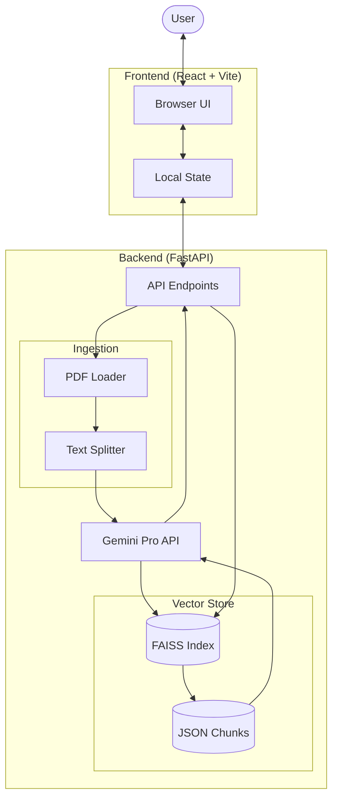
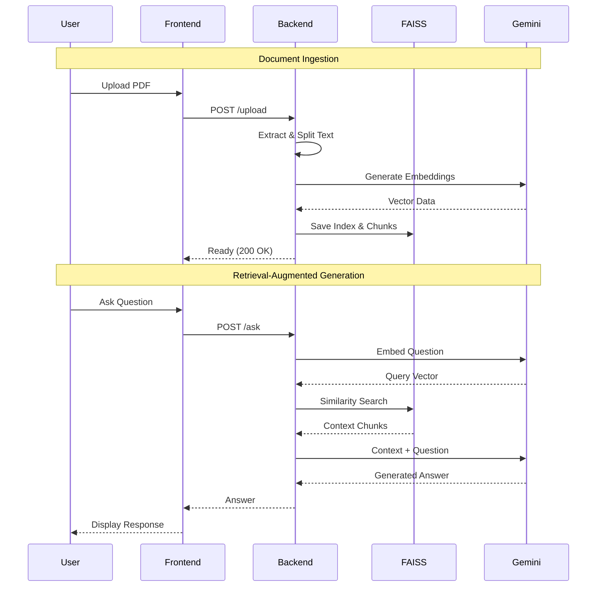

# QueryDoc

A complete full-stack application for securely chatting with PDF documents using Retrieval-Augmented Generation (RAG) and Google's Gemini API.

## Project Architecture

- **Frontend**: React + TypeScript + Vite. A polished, single-page application with a modern SaaS CSS design.
- **Backend**: FastAPI (Python). Handles embedding generation, vector search, and LLM interaction.
- **Infrastructure**: Docker & Docker Compose for easy deployment.

### System Diagram



### RAG Workflow



## Quick Start (Docker)

The easiest way to run the entire system is with Docker Compose.

1. **Prerequisites**: Ensure Docker and Docker Compose are installed.
2. **Run**:
   ```bash
   docker-compose up --build
   ```
3. **Access**:
   - Frontend: `http://localhost:5173`
   - Backend API: `http://localhost:8000`

## Manual Development Setup

### Backend
Navigate to `backend/` and follow the `README.md` to start the FastAPI server on port 8000.

### Frontend
Navigate to `frontend/` and follow the `README.md` to start the Vite dev server on port 5173.

Ensure the backend is running before using the frontend.

## Features

- **Private by Design**: Your API key stays in your browser memory and is sent directly to the backend for that session only.
- **Session Isolation**: Each user session gets its own vector store.
- **Responsive Design**: Works on desktop and mobile.
- **Type Safety**: Full TypeScript support in frontend, Pydantic validation in backend.
